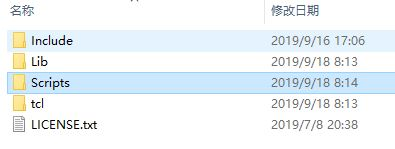
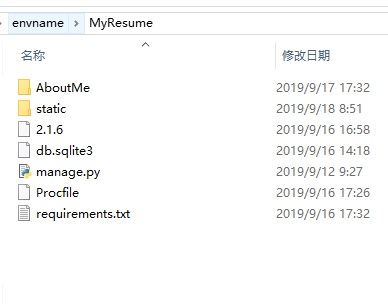

### 使用Virutalenv创建本地环境，为推送代码到heroku做准备
1. 安装pipenv
```
pip install pipenv
```
2. 创建虚拟环境  
如要在当前目录安装虚拟环境，使用：
```
virutalenv .
```
如果要指定python版本，可以使用--python参数，在test目录中安装基于python3.7的虚拟环境如下：
```
virtualenv test --python=C:\Python37\python.exe
```
1. 激活虚拟环境  
在虚拟环境目录，生成了一系列文件夹和文件，如下图：  

激活虚拟环境，使用:  
```
Scripts\activate
```
激活以后可以使用`deactivate`禁用虚拟环境。
1. 将django代码文件的目录拷贝到虚拟环境目录。
1. 进入django代码文件目录，执行后续操作。
3. 在虚拟环境中查看安装的应用
```
pip freeze
```
3. 在虚拟环境中安装django
```
pip install django==2.1
```
1. 在虚拟环境中安装requests
```
pip install requests==2.19.1
```
1. 测试代码能在虚拟环境中运行
```
python manage.py runserver
```

### 配置django herok  
参考[配置procfile](https://devcenter.heroku.com/articles/django-app-configuration)

1. 创建Procfile

将以下内容拷入Procfile
```
web: gunicorn gettingstarted.wsgi 
```
**重要**：注意需要将gettingstarted替换为自己项目的名称。
保存Procfile文件。

1. 在虚拟环境中安装gunicorn
```
pip install gunicorn
```

1. 修改项目中settings.py文件

安装django-heroku
```
pip install django-heroku
```
打开settings.py文件，在文件起始位置键入
```
import django_heroku
```
在文件结束位置键入
```
# Activate Django-Heroku.
django_heroku.settings(locals())
```
保存对settings.py文件的修改。

1. 从虚拟环境中安装的应用生成requirements.txt文件 
```
pip freeze > requirements.txt
```
代码推送到heroku以后，heroku会依据这个requirements.txt文件安装所依赖的应用。

代码文件目录结构将如下所示：


### 使用git将本地代码推送到Heroku

1. 安装Heroku CLI  
[Getting Started on Heroku with Python](https://devcenter.heroku.com/articles/getting-started-with-python#set-up)

1. 登录heroku
```
heroku login
```

1. 创建Website
```
heroku create qijiexueweb
```


1. 本地初始化git库，提交代码到本地库
```
git init
git add -A
git commit -m "first checkin"
```

1. 建立远程连接
```
heroku git:remote -a qijiexueweb
```

1. 推送到远程
```
git push heroku master
```

### 在本地命令行中进入heroku bash，使用bash查看执行heroku上的命令
```
heroku run bash
```
例如, 列出文件，执行migrate，创建数据库超级管理员等命令：
```
ls
python manage.py migrate
python manage.py createsuperuser
```

退出bash
```
exit
```

